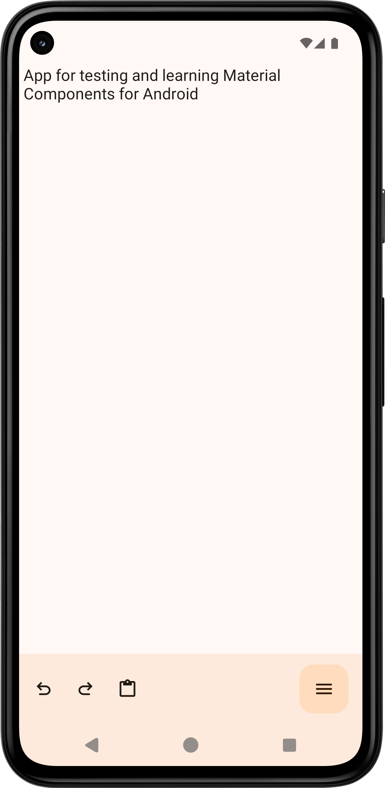
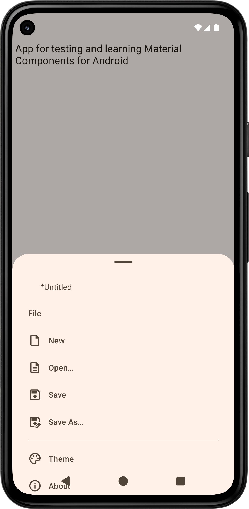
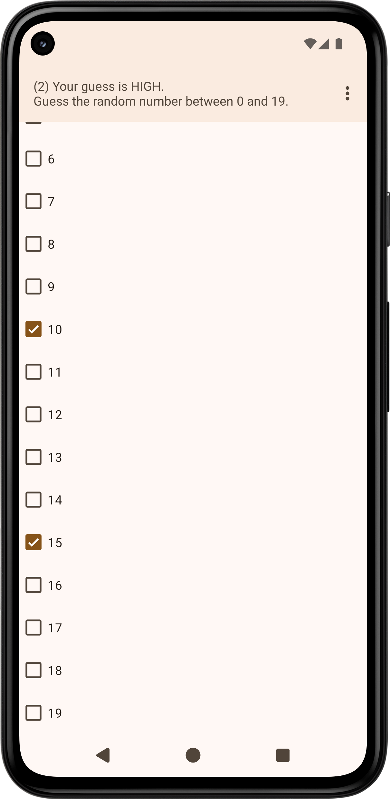
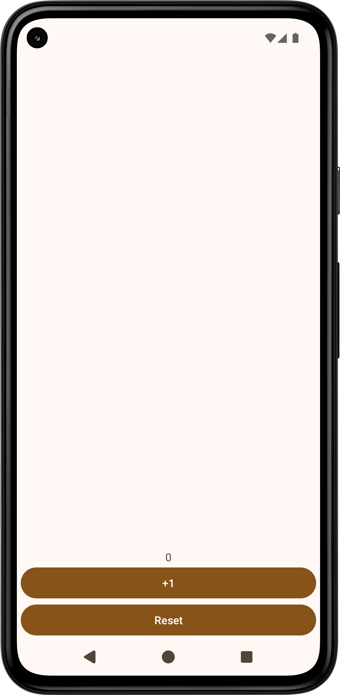

- [Material Components for Android](https://github.com/material-components/material-components-android)
  - App
    - [editor](editor)
      - https://m3.material.io/
        - https://github.com/material-components/material-components-android
        - https://github.com/material-components/material-components-android/tree/master/docs
      - https://developer.android.com/develop/ui/views/theming/dynamic-colors
      - https://developer.android.com/develop/ui/views/theming/darktheme
      - https://developer.android.com/develop/ui/views/layout/edge-to-edge
        - https://issuetracker.google.com/issues/326356902
      - https://developer.android.com/topic/libraries/view-binding
      - https://developer.android.com/training/data-storage/shared/documents-files
      - https://developer.android.com/training/basics/intents/result
      - https://developer.android.com/topic/libraries/architecture/viewmodel
      - https://developer.android.com/training/data-storage/shared-preferences
    - [editork](editork) (kotlin editor)
    - [game](game)
    - [counter](counter)
      - https://developer.android.com/topic/libraries/architecture/livedata
    - Plan
      - add comments
      - add documentation
        - [memo](wiki/memo)
      - add new apps
  - [Contributions](https://github.com/material-components/material-components-android/issues?q=author%3Amanabu-nakamura) 🟥
- [Jetpack Compose](https://developer.android.com/compose)
  - [App](https://github.com/manabu-nakamura/appc) 🟥
  - [Contributions](https://github.com/android/compose-samples/issues?q=author%3Amanabu-nakamura) 🟥

https://github.com/manabu-nakamura