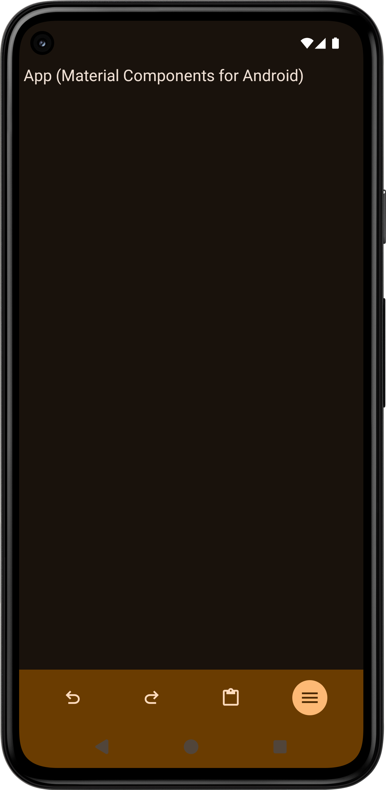

App ([Material Components for Android](https://github.com/material-components/material-components-android))
- [Material Components for Android](https://github.com/material-components/material-components-android)
  - [Contributions](https://github.com/material-components/material-components-android/issues?q=author%3Amanabu-nakamura) ([PRs are not directly merged into the repository](https://github.com/material-components/material-components-android/blob/master/docs/contributing.md#pull-request-process)) 🟥
    - [Commits](https://github.com/material-components/material-components-android/commits?author=manabu-nakamura) 🟥
  - App and [Memo](docs/memo.md) 🟥
    - editor ([Java](editor) and [Kotlin](editork))
      - https://m3.material.io/
        - https://m3.material.io/blog/building-with-m3-expressive
        - https://github.com/material-components/material-components-android
        - https://github.com/material-components/material-components-android/tree/master/docs
      - https://developer.android.com/develop/ui/views/theming/dynamic-colors
      - https://developer.android.com/develop/ui/views/theming/darktheme
      - https://developer.android.com/develop/ui/views/layout/edge-to-edge
        - https://issuetracker.google.com/issues/326356902
      - https://developer.android.com/topic/libraries/view-binding
      - https://developer.android.com/training/data-storage/shared/documents-files
      - https://developer.android.com/training/basics/intents/result
      - https://developer.android.com/topic/libraries/architecture/viewmodel
      - https://developer.android.com/training/data-storage/shared-preferences
    - [game](game)
    - [counter](counter)
      - https://developer.android.com/topic/libraries/architecture/livedata
    - Plan
      - add comments
      - add documentation
      - add new apps
- [Jetpack Compose](https://developer.android.com/compose)
  - [Contributions](https://github.com/android/compose-samples/issues?q=author%3Amanabu-nakamura) 🟥
  - [App](https://github.com/manabu-nakamura/appc) and [Memo](https://github.com/manabu-nakamura/appc/blob/main/docs/memo.md) 🟥

\
\

[Manabu Nakamura](https://github.com/manabu-nakamura)