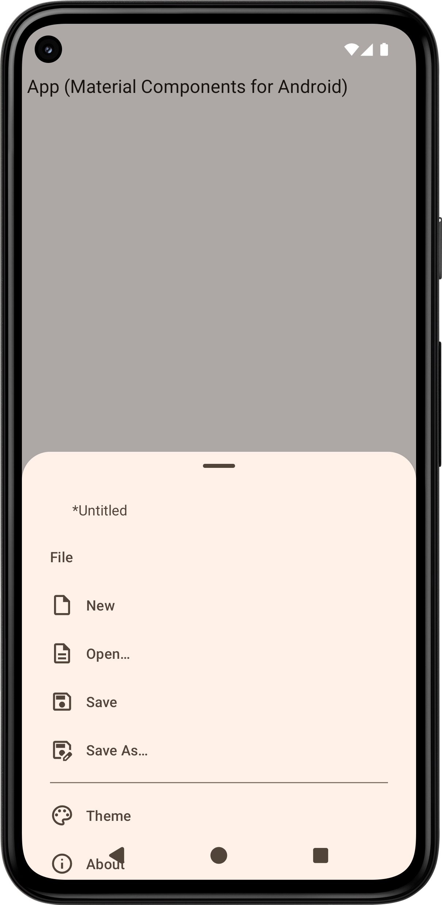
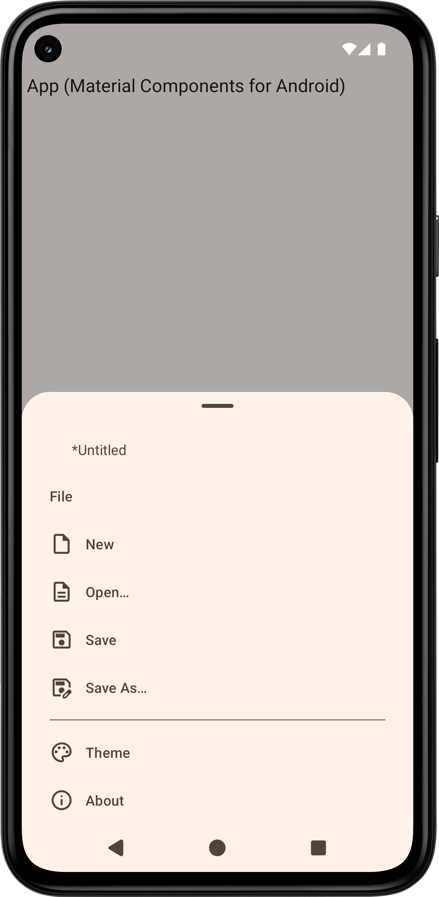
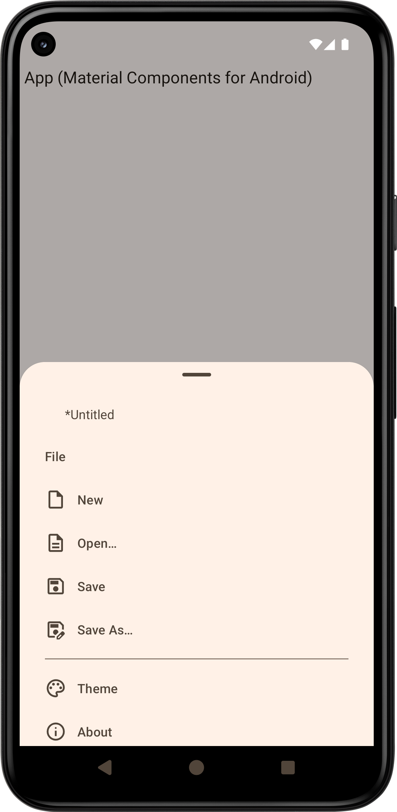
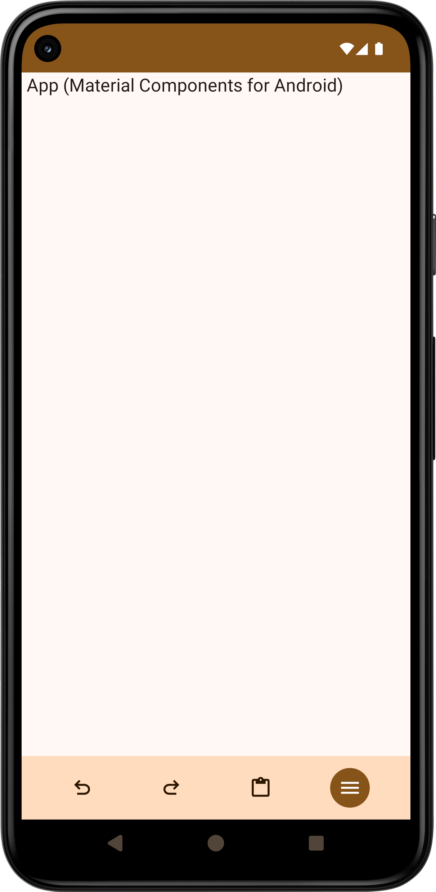
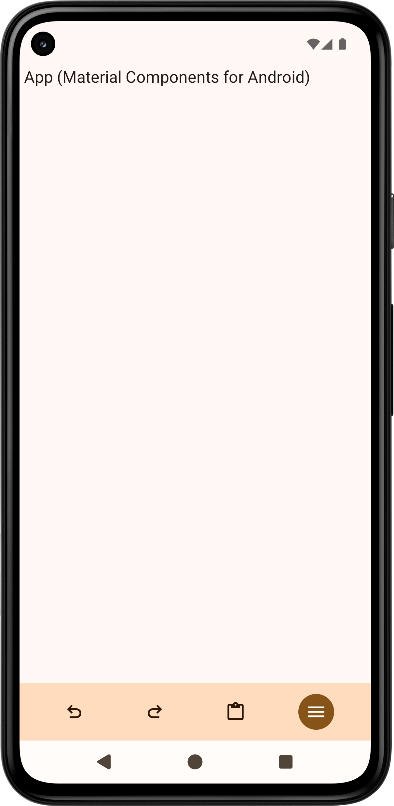
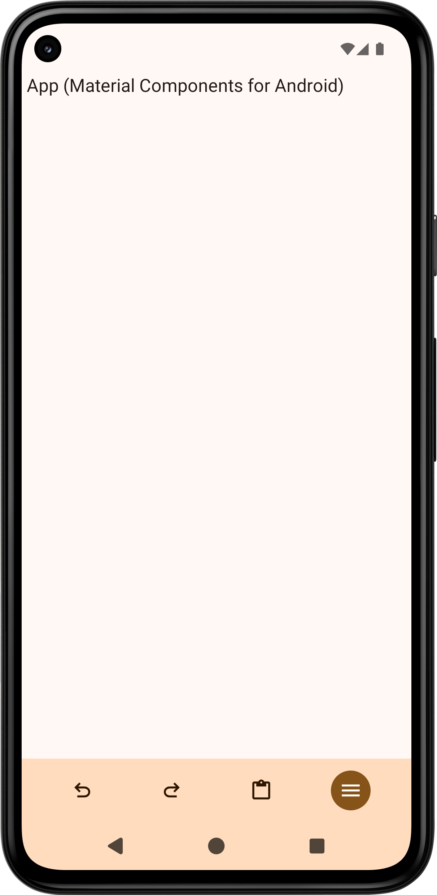
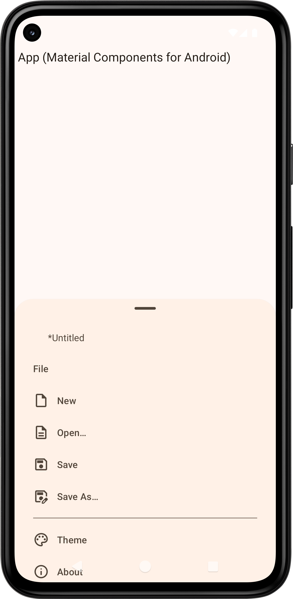
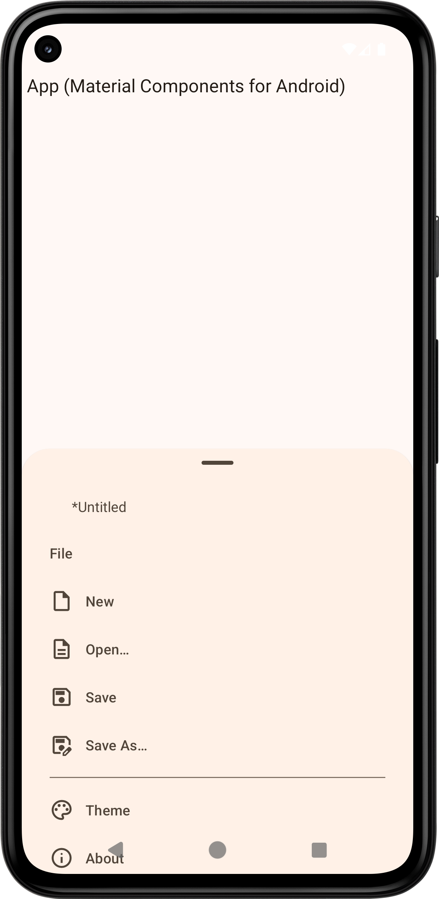

> [!CAUTION]
> The app targeted Android 15 and ran on Android 15 (Android Emulator).\
> https://developer.android.com/about/versions/15/behavior-changes-15

🟥https://github.com/manabu-nakamura/app/blob/master/editor/src/main/res/values/themes.xml:
- `android:enforceNavigationBarContrast`
```xml
<style name="Theme.App" parent="Theme.Material3.DynamicColors.DayNight.NoActionBar">
    <item name="android:enforceNavigationBarContrast">false</item>
</style>
```
->\
x->`<item name="android:enforceNavigationBarContrast">false</item>`

🟥https://github.com/manabu-nakamura/app/blob/master/editor/src/main/java/com/github/manabu_nakamura/editor/MainActivity.java:
- edge-to-edge
```java
EdgeToEdge.enable(this);
if (Build.VERSION.SDK_INT >= Build.VERSION_CODES.Q) {
    getWindow().setNavigationBarContrastEnforced(false);
}
```
->->\
x->`EdgeToEdge.enable(this)`->`getWindow().setNavigationBarContrastEnforced(false)`\
https://issuetracker.google.com/issues/362137845, https://issuetracker.google.com/issues/326356902

> [!CAUTION]
> The app targeted Android 14 and ran on Android 15 (Android Emulator).\
> https://developer.android.com/about/versions/15/behavior-changes-15

🟥https://github.com/manabu-nakamura/app/blob/master/editor/src/main/res/values/themes.xml:
- `android:enforceNavigationBarContrast`
```xml
<style name="Theme.App" parent="Theme.Material3.DynamicColors.DayNight.NoActionBar">
    <item name="bottomSheetDialogTheme">@style/ThemeOverlay.App.BottomSheetDialog</item>
    <item name="android:enforceNavigationBarContrast">false</item>
</style>

<style name="ThemeOverlay.App.BottomSheetDialog" parent="ThemeOverlay.Material3.BottomSheetDialog">
    <item name="android:navigationBarColor">@android:color/transparent</item>
</style>
```
->\
x->`<item name="android:enforceNavigationBarContrast">false</item>`

- `paddingBottomSystemWindowInsets`
```xml
<style name="Theme.App" parent="Theme.Material3.DynamicColors.DayNight.NoActionBar">
    <item name="bottomSheetDialogTheme">@style/ThemeOverlay.App.BottomSheetDialog</item>
    <item name="android:enforceNavigationBarContrast">false</item>
</style>

<style name="ThemeOverlay.App.BottomSheetDialog" parent="ThemeOverlay.Material3.BottomSheetDialog">
    <item name="bottomSheetStyle">@style/Widget.App.BottomSheet.Modal</item>
</style>

<style name="Widget.App.BottomSheet.Modal" parent="Widget.Material3.BottomSheet.Modal">
    <item name="paddingBottomSystemWindowInsets">false</item>
</style>
```
->\
x->`<item name="paddingBottomSystemWindowInsets">false</item>`\
https://github.com/material-components/material-components-android/issues/3173#issuecomment-1376719392

- `android:navigationBarColor`
```xml
<style name="Theme.App" parent="Theme.Material3.DynamicColors.DayNight.NoActionBar">
    <item name="bottomSheetDialogTheme">@style/ThemeOverlay.App.BottomSheetDialog</item>
    <item name="android:enforceNavigationBarContrast">false</item>
</style>

<style name="ThemeOverlay.App.BottomSheetDialog" parent="ThemeOverlay.Material3.BottomSheetDialog">
    <item name="android:navigationBarColor">@android:color/transparent</item>
</style>
```
->\
x->`<item name="android:navigationBarColor">@android:color/transparent</item>`\
https://github.com/material-components/material-components-android/blob/master/docs/components/BottomSheet.md#handling-insets-and-fullscreen

🟥https://github.com/manabu-nakamura/app/blob/master/editor/src/main/java/com/github/manabu_nakamura/editor/MainActivity.java:
- edge-to-edge
```java
EdgeToEdge.enable(this);
if (Build.VERSION.SDK_INT >= Build.VERSION_CODES.Q) {
    getWindow().setNavigationBarContrastEnforced(false);
}
```
->->\
x->`EdgeToEdge.enable(this)`->`getWindow().setNavigationBarContrastEnforced(false)`\
https://issuetracker.google.com/issues/326356902

> [!CAUTION]
> The app ran on Android 14 (Android Emulator).\
> https://issuetracker.google.com/issues/295296005

🟥https://github.com/manabu-nakamura/app/blob/master/editor/src/main/res/values/themes.xml:
- `android:windowLightNavigationBar`
```xml
<style name="Theme.App" parent="Theme.Material3.DynamicColors.DayNight.NoActionBar">
    <item name="bottomSheetDialogTheme">@style/ThemeOverlay.App.BottomSheetDialog</item>
    <item name="android:enforceNavigationBarContrast">false</item>
</style>

<style name="ThemeOverlay.App.BottomSheetDialog" parent="ThemeOverlay.Material3.BottomSheetDialog">
    <item name="android:windowLightNavigationBar">?isLightTheme</item>
</style>
```
->\
x->`<item name="android:windowLightNavigationBar">?isLightTheme</item>`

> [!CAUTION]
> The app ran on Android 13 (Android Emulator).\
> https://github.com/material-components/material-components-android/issues/4293

🟥https://github.com/manabu-nakamura/app/blob/master/editor/src/main/res/values/themes.xml:
- `android:windowLightNavigationBar`
```xml
<style name="Theme.App" parent="Theme.Material3.DynamicColors.DayNight.NoActionBar">
    <item name="bottomSheetDialogTheme">@style/ThemeOverlay.App.BottomSheetDialog</item>
    <item name="android:enforceNavigationBarContrast">false</item>
</style>

<style name="ThemeOverlay.App.BottomSheetDialog" parent="ThemeOverlay.Material3.BottomSheetDialog">
    <item name="android:windowLightNavigationBar">?isLightTheme</item>
</style>
```
->\
x->`<item name="android:windowLightNavigationBar">?isLightTheme</item>`

[Manabu Nakamura](https://github.com/manabu-nakamura)